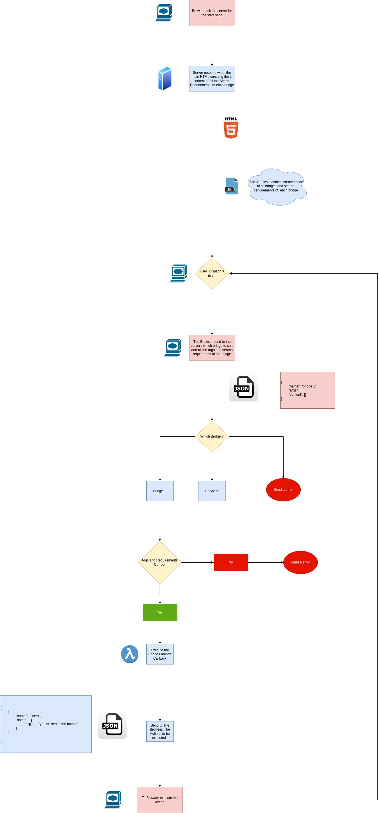

# CWebSudio
CWebSudio is a micro framework to deal with web aplications in C/C++. It's a
single header library that provides a lot of functionality such as reading headers,
query parameters, returning files, and text.
# Try it online
if you want to try it online , you can do it by using cloning the [Code Sandbox Template](https://codesandbox.io/p/devbox/dmy7xm)

# Installation

## Single File
CWebSudio is made to be as dumb as possible and adopt the idea of single file library.
For installation, simply copy the **CWebStudio.h** into your project and compile with gcc/g++ or clang.

[Download Link](https://github.com/OUIsolutions/CWebStudio/releases/download/v2.003/CWebStudio.h)

if you prefer , you can run the following command:
```shell 
curl -L https://github.com/OUIsolutions/CWebStudio/releases/download/v3.002/CWebStudio.h -o CWebStudio.h
```
~~~c
#include "CWebStudio.h"
CwebNamespace cweb;

CwebHttpResponse *main_sever(CwebHttpRequest *request ){

    return cweb.response.send_text("Hello World", 200);

}

int main(int argc, char *argv[]){
    cweb = newCwebNamespace();
    struct CwebServer server = newCwebSever(5000, main_sever);
    cweb.server.start(&server);
    return 0;
}
~~~

The Source Code its available here:
[Source](https://github.com/OUIsolutions/CWebStudio)
## Full Folder
You can also download the entire **CwebStudio** folder to your project and run with the

**#include "src/one.c"** header:

~~~c
#include "src/one.c"
CwebNamespace cweb;

CwebHttpResponse *main_sever(CwebHttpRequest *request ){


    return cweb.response.send_text("Hello World", 200);

}

int main(int argc, char *argv[]){
    cweb = newCwebNamespace();
    struct CwebServer server = newCwebSever(5000, main_sever);
    cweb.server.start(&server);
    return 0;
}
~~~

## Building from scratch
if you want to build from scracth , just clone the repo and run 
```shell
sh pre_build.sh 
./build.out
```

# Getting Entries

## Route a Method

Working with URL parameters is very easy, as seen in the following example:

~~~c

#include "CWebStudio.h"

CwebNamespace cweb;

CwebHttpResponse *main_sever(CwebHttpRequest *request ){

    char *url = request->url;
    char *method = request->method;
    char *route = request->route;

    printf("URL: %s\n", url);
    printf("Method: %s\n", method);
    printf("Route: %s\n", route);
    return cweb.response.send_text("Hello World", 200);

}

int main(int argc, char *argv[]){
    cweb = newCwebNamespace();
    CwebServer server = newCwebSever(5000, main_sever);
    cweb.server.start(&server);
    return 0;
}
~~~


## Getting Query param

for getting query params its super easy, just use the **cweb.request.get_param** function

~~~c
#include "CWebStudio.h"

CwebNamespace cweb;

CwebHttpResponse *main_sever(CwebHttpRequest *request ){

    char *name = cweb.request.get_param(request,"name");
    if(name){
        printf("%s\n",name);
    }
    else{
        printf("name not provided\n");
    }
    return cweb.response.send_text("Hello World", 200);

}

int main(int argc, char *argv[]){
    cweb = newCwebNamespace();
    struct CwebServer server = newCwebSever(5000, main_sever);
    cweb.server.start(&server);
    return 0;
}
~~~


## Iterating over Query Parameters

To iterate through parameters, the object **CwebDict** may be used like this:

~~~c
#include "CWebStudio.h"
CwebNamespace cweb;

CwebHttpResponse *main_sever(CwebHttpRequest *request ){

    CwebDict *query_paramns = request->params;
    for(int i = 0; i < query_paramns->size; i++){
        CwebKeyVal *key_val = query_paramns->keys_vals[i];
        char *key = key_val->key;
        char *value = key_val->value;
        printf("%s : %s\n", key, value);
    }
    printf("------------------------------------------\n");
    return cweb.response.send_text("Hello World", 200);

}

int main(int argc, char *argv[]){
    cweb = newCwebNamespace();
    CwebServer server = newCwebSever(5000, main_sever);
    cweb.server.start(&server);
    return 0;
}
~~~

## UrlEncode Parameters
Cweb Studio also supports url parameter encoding. To do so, call the method
**request->read_content** to parse the body:


~~~c

#include "CWebStudio.h"
CwebNamespace cweb;

CwebHttpResponse *main_sever(CwebHttpRequest *request ){
    cweb.request.read_content(request, 20000);
    CwebDict *query_paramns = request->params;
    for(int i = 0; i < query_paramns->size; i++){
        CwebKeyVal *key_val = query_paramns->keys_vals[i];
        char *key = key_val->key;
        char *value = key_val->value;
        printf("%s : %s\n", key, value);
    }
    printf("-----------------------------------------------\n");;
    return cweb.response.send_text("Url readed", 200);

}

int main(int argc, char *argv[]){
    cweb = newCwebNamespace();
    CwebServer server = newCwebSever(5000, main_sever);
    cweb.server.start(&server);
    return 0;
}
~~~


## Getting Headders
for retriving headers use the **cweb.request.get_header** function


~~~c
#include "CWebStudio.h"

CwebNamespace cweb;

CwebHttpResponse *main_sever(CwebHttpRequest *request ){

    char *name = cweb.request.get_header(request,"name");
    if(name){
        printf("%s\n",name);
    }
    else{
        printf("name not provided\n");
    }
    return cweb.response.send_text("Hello World", 200);

}

int main(int argc, char *argv[]){
    cweb = newCwebNamespace();
    struct CwebServer server = newCwebSever(5000, main_sever);
    cweb.server.start(&server);
    return 0;
}
~~~

## Iterating over Headers

Similar to iterating through URL parameters, iterating through headers is equally as simple:

~~~c


#include "CWebStudio.h"
CwebNamespace cweb;

CwebHttpResponse *main_sever( CwebHttpRequest *request ){

    CwebDict *headers = request->headers;
    for(int i = 0; i < headers->size; i++){
        struct CwebKeyVal *key_val = headers->keys_vals[i];
        char *key = key_val->key;
        char *value = key_val->value;
        printf("%s : %s\n", key, value);
    }
    printf("-------------------------------\n");
    return cweb.response.send_text("Headers Iterated", 200);

}


int main(int argc, char *argv[]){
    cweb = newCwebNamespace();
    CwebServer server = newCwebSever(5000, main_sever);
    cweb.server.start(&server);
    return 0;
}
~~~


## Reading Body Content
Accessing the body content may be done by calling the function **request->read_content**.
The content will be accessible with **request->content** and **request->content_length**:

~~~c
#include "CWebStudio.h"

CwebNamespace cweb;

CwebHttpResponse *main_sever( CwebHttpRequest *request ){
    int one_mega_byte = 1048576;

    unsigned char *body =  cweb.request.read_content(request, one_mega_byte);

    if(body){
        printf("body: %s",(char*)body);
         return cweb_send_text("Body Readed", 200);

    }
    return cweb_send_text("Body Not Readed", 200);


}

int main(int argc, char *argv[]){
    cweb = newCwebNamespace();
    CwebServer server = newCwebSever(5000, main_sever);
    cweb.server.start(&server);
    return 0;
}
~~~

## Parsing JSON
CwebStudio has cJSON integrated into the library. For more information, see
https://github.com/DaveGamble/cJSON.


~~~c
#include "CWebStudio.h"
CwebNamespace cweb;
CwebHttpResponse *main_sever( CwebHttpRequest *request ){

    int one_mega_byte = 1048576;
    cJSON *json  = cweb.request.read_cJSON(request,one_mega_byte);
    if(!json){
        return cweb.response.send_text("not passed or not valid json",404);
    }

    cJSON *name = cJSON_GetObjectItemCaseSensitive(json, "name");
    cJSON *age = cJSON_GetObjectItemCaseSensitive(json, "age");

    if(!name){
        return cweb.response.send_text("name not provided",404);
    }

    if(name->type != cJSON_String){
        return cweb.response.send_text("name its not a string",404);
    }
    if(!age){
        return cweb.response.send_text("age not provided",404);
    }

    if(age->type != cJSON_Number){
        return cweb.response.send_text("age its not a number",404);
    }

    printf("Name: %s\n", name->valuestring);
    printf("Age: %d\n", age->valueint);


    return cweb_send_text("json parserd", 200);

}

int main(int argc, char *argv[]){
    cweb = newCwebNamespace();
    CwebServer server = newCwebSever(5000, main_sever);
    cweb.server.start(&server);
    return 0;
}
~~~

## Returning Json from cJSON
if you want to return values from cJSON, you can call the **cweb.response.send_cJSON_cleaning_memory** or
**cweb.response.send_cJSON** to return cjson values

~~~c
#include "CWebStudio.h"

CwebNamespace cweb;

CwebHttpResponse *main_sever(CwebHttpRequest *request ){


    cJSON * custom = cJSON_CreateObject();
    cJSON_AddStringToObject(custom,"a","value of a");
    cJSON_AddStringToObject(custom,"b","value of b");
    CwebHttpResponse *response = cweb.response.send_cJSON_cleaning_memory(custom,200);
    return response;
}


int main(int argc, char *argv[]){
    cweb = newCwebNamespace();
    CwebServer server = newCwebSever(5000, main_sever);
    cweb.server.start(&server);
    return 0;
}
~~~


~~~c

#include "CWebStudio.h"

CwebNamespace cweb;

CwebHttpResponse *main_sever(CwebHttpRequest *request ){

    const char *json = "{\"name\":\"CWebStudio\",\"version\":\"1.0.0\"}";
    return cweb.response.send_json_string(json,200);

}


int main(int argc, char *argv[]){
    cweb = newCwebNamespace();
    CwebServer server = newCwebSever(5000, main_sever);
    cweb.server.start(&server);
    return 0;
}
~~~


## Reading Binary Content

~~~c
#include "CWebStudio.h"

CwebNamespace cweb;


void write_binary_file(char *path, unsigned char *content, int size)
{
    FILE *file = fopen(path, "wb");
    fwrite(content, sizeof(unsigned char), size, file);
    fclose(file);
}


struct CwebHttpResponse *main_sever(struct CwebHttpRequest *request ){

    int two_mega_bytes = 2097152;
    char *name = cweb.request.get_param(request, "name");
    if(!name){
        return cweb.response.send_text("name not provided\n",404);
    }
    unsigned char *content = cweb.request.read_content(request, two_mega_bytes);
    if(content){
        write_binary_file(name,content, request->content_length);
        return cweb_send_text("File Written", 200);
    }
    return cweb_send_text("No Content Provided", 200);


}

int main(int argc, char *argv[]){
    cweb = newCwebNamespace();
    CwebServer server = newCwebSever(5000, main_sever);
    cweb.server.start(&server);
    return 0;
}
~~~

# Returning Values
## Plain Text
Returning plain text is simple with **cweb_send_text**:

~~~c
#include "CWebStudio.h"
CwebNamespace cweb;

CwebHttpResponse *main_sever(CwebHttpRequest *request ){


    return cweb.response.send_text("Exemple of Return", 200);
    
}

int main(int argc, char *argv[]){
    cweb = newCwebNamespace();
    CwebServer server = newCwebSever(5000, main_sever);
    cweb.server.start(&server);
    return 0;
}
~~~

**cweb_send_text_cleaning_memory** can handle strings:

~~~c
#include "CWebStudio.h"

CwebNamespace cweb;

CwebHttpResponse *main_sever(CwebHttpRequest *request ){

    char *teste = (char*)malloc(100);
    strcpy(teste, "Hello World");
    return cweb.response.send_text_cleaning_memory(teste,200);
}


int main(int argc, char *argv[]){
    cweb = newCwebNamespace();
    CwebServer server = newCwebSever(5000, main_sever);
    cweb.server.start(&server);
    return 0;
}

~~~

## Rendered HTML
To return rendered HTML, the function **cweb_send_rendered_CTextStack_cleaning_memory** may be used. Memory will be automatically cleaned:

see more at https://github.com/OUIsolutions/CTextEngine

~~~c
#include "CWebStudio.h"


CwebNamespace cweb;

CwebHttpResponse *main_sever( CwebHttpRequest *request ){

    CTextStackModule m = newCTextStackModule();

    CTextStack *s = m.newStack(CTEXT_LINE_BREAKER, CTEXT_SEPARATOR);

    const char *lang = "en";
    const char *text = "text exemple";
    CTextScope_format(s, CTEXT_HTML,"lang=\"%s\"",lang){
        CTextScope(s,CTEXT_HEAD){}
        CTextScope(s,CTEXT_BODY){
            CTextScope(s,CTEXT_H1){
                m.segment_text(s,"This is a text");
            }
            CTextScope(s,CTEXT_P){
                m.segment_format(s,"This is a formated  text  %s",text);

            }
        }
    }
    return cweb_send_rendered_CTextStack(s,200);
}


int main(int argc, char *argv[]){
    cweb = newCwebNamespace();
    CwebServer server = newCwebSever(5000, main_sever);
    cweb.server.start(&server);
    return 0;
}

~~~

## HTML
To generate HTML from a file, the **cweb_send_var_html** function may be used:

~~~c
#include "CWebStudio.h"
CwebNamespace cweb;

struct CwebHttpResponse *main_sever(struct CwebHttpRequest *request ){

    const char *html = "<html><body><h1>Hello World</h1></body></html>";
    return cweb.response.send_var_html(html,200);
}

int main(int argc, char *argv[]){
    cweb = newCwebNamespace();
    CwebServer server = newCwebSever(5000, main_sever);
    cweb.server.start(&server);
    return 0;
}

~~~

As is done with returning plain text, memory will be automatically cleaned with **cweb_send_var_html_cleaning_memory**:


~~~c
#include "CWebStudio.h"
CwebNamespace cweb;

struct CwebHttpResponse *main_sever(struct CwebHttpRequest *request ){

    char *html = (char*)malloc(1000);
    strcat(html, "<html><body><h1>Hello World</h1></body></html>");
    return cweb.response.send_var_html_cleaning_memory(html,200);
}

int main(int argc, char *argv[]){
    cweb = newCwebNamespace();
    CwebServer server = newCwebSever(5000, main_sever);
    cweb.server.start(&server);
    return 0;
}

~~~

## Returning Files
Files can be directly returned by referencing the path:

~~~c
#include "CWebStudio.h"

CwebNamespace cweb;

CwebHttpResponse *main_sever(CwebHttpRequest *request ){

    return cweb_send_file(
            "my_image.png",
            CWEB_AUTO_SET_CONTENT,
            200
    );

}

int main(int argc, char *argv[]){
    cweb = newCwebNamespace();
    CwebServer server = newCwebSever(5000, main_sever);
    cweb.server.start(&server);
    return 0;
}
~~~

## Returning Other Formats
Other formats may be returned like this:

~~~c
#include "CWebStudio.h"
CwebNamespace cweb;

struct CwebHttpResponse *main_sever(struct CwebHttpRequest *request ){

    const char *html = "<html><body><h1>Hello World</h1></body></html>";
    return cweb.response.send_any("text/html",strlen(html),(unsigned char*)html,200);
}

int main(int argc, char *argv[]){
    cweb = newCwebNamespace();
    CwebServer server = newCwebSever(5000, main_sever);
    cweb.server.start(&server);
    return 0;
}
~~~


### Static Files
Static files (javascript/css/html) can be referenced and returned in the static directory:

~~~html

    
~~~
### Especial Static Files

#### static/favicon.(jpg|png|ico)
if you put a  **static/favico.jpg** or   **static/favico.png** or   **static/favico.ico**
into yur static folder, it will automatic became the favicon
#### static/404.html
if you put an **static/400.html** into your static file, it will be used when an 404 error happen

#### static/500.html
if you put an **static/400.html** into your static file, it will be used when an internal error happen


#### Custom Error Pages
To return a custom error page, place the <error_code>.html in the static directory. Creating a 500.html into the static directory, for example, will return this page when a 500 error occurs.

#### Smart Cache
Dynamic caching may be used inside HTML by using smart_cache:
~~~html
    
~~~

#### Inline inclusion
Its also possible to generate inline inclusion with:
~~~html
    <div>
        inline-include='static/teste3.html'
    </div>

~~~

#### Smart Cache in Rendered Text
Smart caching with rendered text can be done with **private_cweb_smart_static_ref**:

~~~c
#include "CWebStudio.h"
CwebNamespace cweb;

CwebHttpResponse *main_sever(CwebHttpRequest *request ){

    const char *lang = "en";
    const char *text = "text exemple";
    CTextStackModule  m = newCTextStackModule();
    struct CTextStack *s = newCTextStack(CTEXT_LINE_BREAKER, CTEXT_SEPARATOR);

    m.open_format(s,CTEXT_HTML,"lang=\"%s\"",lang);
        m.open(s,CTEXT_HEAD);

            char *fav_icon_link = cweb_smart_static_ref("favicon.ico");
            m.auto_close_format(s,CTEXT_LINK,"rel=\"shortcut icon\" href=\"%s\"",fav_icon_link);
            free(fav_icon_link);

        m.close(s,CTEXT_HEAD);
        m.open(s,CTEXT_BODY);

            char *img_link = cweb_smart_static_ref("my_image.png");
            m.auto_close_format(s,CTEXT_IMG,"src=\"%s\" width=\"200px\"",img_link);
            free(img_link);

        m.close(s,CTEXT_BODY);
    m.close(s,CTEXT_HTML);
    return cweb.response.send_rendered_CTextStack(s,200);

}

int main(int argc, char *argv[]){
    cweb = newCwebNamespace();
    CwebServer server = newCwebSever(5000, main_sever);
    cweb.server.start(&server);
    return 0;
}

~~~


## CWEB_DEBUG FLAG
**CWEB_DEBUG** will provide useful debugging information:

~~~c

#define CWEB_DEBUG
#include "CWebStudio.h"
CwebNamespace cweb;
CwebHttpResponse *main_sever(CwebHttpRequest *request ){

    return cweb.response.send_text("Hello World", 200);
    
}

int main(int argc, char *argv[]){
    cweb = newCwebNamespace();
    CwebServer server = newCwebSever(5000, main_sever);
    cweb.server.start(&server);
    return 0;
}
~~~

# KIlling the server

if you want to kill the server for any reason, like testing memory leaks or finish the server
you can just change the var **cweb_end_server** to true

~~~c
#include "CWebStudio.h"

CwebNamespace cweb;

CwebHttpResponse *main_sever(CwebHttpRequest *request ){

    if(strcmp(request->route,"/kill") == 0){
            cweb_kill_single_process_server();
    }
    return cweb.response.send_text("Working", 200);

}

int main(int argc, char *argv[]){
    cweb = newCwebNamespace();
    CwebServer server = newCwebSever(5000, main_sever);
    server.single_process = true;
    cweb.server.start(&server);
    return 0;
}
~~~

# Configuring The Server
Several server configuration parameters may be set:

~~~c

#include "CWebStudio.h"
CwebNamespace cweb;

struct CwebHttpResponse *main_sever(struct CwebHttpRequest *request ){

    return cweb.response.send_text("Hello World", 200);

}

int main(){
    cweb = newCwebNamespace();

    CwebServer server = newCwebSever(5000, main_sever);
    //the higher time of the request handler
    //after that , the sever will return 500
    // these is useful to prevent the server infinite loop
    server.function_timeout = 30;
    //the higher time of the client
    //after that , the sever will return 408
    //these is useful to prevent invalid requests
    server.client_timeout = 5;

    //these atributes define to allow cros origins domains
    server.allow_cors = true;

    //the max queue of the server
    server.max_queue = 100;
    //if true , the server will run in single process
    server.single_process = false;
    //the max simultaneous requests
    server.max_requests = 1000;
    //if true , the server will use the static files located into the folder "static"
    server.use_static = true;

    //define where to loock for static content
    server.static_folder = "static";

    cweb.server.start(&server);
    return 0;
}
~~~


# HyDration
The HyDration mechanic it's a mecanic to generate front end code in C, its based on the ideia
of controling the browser by creating javascript


~~~c
#include "CWebStudio.h"

CwebNamespace cweb;
CTextStackModule stack;
CWebHydrationNamespace hydration_module;
CWebHydrationBridgeNamespace bridge_module;
CWebHydrationActionsNamespace actions;
CWebHydrationSearchRequirementsNamespace requirements;
CWebHydrationSearchResultNamespace result_module;
CWebHydrationArgsNamespace hydration_args;

#define ALERT_BRIDGE "alert"


void alert_bridge_callback(CWebHyDrationBridge * bridge){
    actions.alert(bridge,"you clicked in the button");
}

CTextStack *create_main_page(CWebHyDration *hydration){

    CTextStack  *main_html =  hydration_module.create_stack(hydration);

    CTextScope(main_html, CTEXT_HTML){
        CTextScope(main_html, CTEXT_HEAD){
            CTextScope(main_html, CTEXT_HEAD){
                CTextScope(main_html, CTEXT_SCRIPT){
                    char *script_generation = hydration_module.create_script(hydration);
                    stack.text(main_html,script_generation);
                }
            }
        }
        CTextScope(main_html, CTEXT_BODY){

            CWebHyDrationBridge *alert_bridge = bridge_module.get_child_bridge(
                hydration,ALERT_BRIDGE
            );

            CTextScope_format(main_html,CTEXT_BUTTON,
                bridge_module.onclick(alert_bridge,NULL)
            ){
                stack.text(main_html,"click me");
            }

        }
    }
    return main_html;
}

CwebHttpResponse *main_server(CwebHttpRequest *request){


    CWebHyDration *hydration = hydration_module.newCWebHyDration(request);
    CWebHyDrationBridge *alert_bridge = bridge_module.create_bridge(
        hydration,
        ALERT_BRIDGE,
        alert_bridge_callback
    );
    //if is
    if(hydration_module.is_the_trigger(hydration)){
        return hydration_module.generate_response(hydration);
    }

    CTextStack  *page =  create_main_page(hydration);
    return cweb.response.send_rendered_CTextStack(page,200);
}


int main(){

    cweb = newCwebNamespace();
    stack = newCTextStackModule();
    hydration_module = cweb.hydration;
    bridge_module = hydration_module.bridge;
    requirements = hydration_module.search_requirements;
    result_module  = hydration_module.search_result;
    hydration_args = hydration_module.args;
    actions = hydration_module.actions;
    CwebServer server = newCwebSever(3000, main_server);
    server.single_process = true;
    cweb.server.start(&server);
}

~~~

# HyDration Explanation
The HyDration its divided in 3 steps , first , you create the bridges, which its
the functions to be called when some event get dispached, than you need to specify which elements
the requirements the browser must return to thatfunction, it can be a html element, a session element
etc, than the the bridge callback handler its called, and the server returns to the browser, what actions
must be made




# Search Requirements
Search Requirements, its where you specify which elements the browser must return to the bridge lambda

```c

CWebHyDrationBridge * alert_bridge = bridge_module.create_bridge(
    hydration,
    ALERT_BRIDGE,
    alert_bridge_callback
);

CWebHyDrationSearchRequirements *name =
requirements.newSearchRequirements(alert_bridge,"name");
requirements.add_elements_by_id(name,"name");

```
# Search Result
SearchResult are  the objects  used to retrive the informations sended by the
browser, defined in the search requirements

```c
CWebHyDrationSearchResult * name = result_module.get_search_by_name(bridge,"name");
char *first_result_of_name = result_module.get_string(name,0);
```

# Actions
The Actions its the actions that you want to be executed in the browser, it can be a alert
a javascript execution, a  element to add/replace/destroy

```c
actions.alert(bridge,"hello %s",first_result_of_name);
```

## Full Runalble exemplo

~~~c

#include "CWebStudio.h"


CwebNamespace cweb;
CTextStackModule stack;
CWebHydrationNamespace hydration_module;
CWebHydrationBridgeNamespace bridge_module;
CWebHydrationActionsNamespace actions;
CWebHydrationSearchRequirementsNamespace requirements;
CWebHydrationSearchResultNamespace result_module;
CWebHydrationArgsNamespace hydration_args;

#define ALERT_BRIDGE "alert"


void alert_bridge_callback(CWebHyDrationBridge * bridge){
    CWebHyDrationSearchResult * name = result_module.get_search_by_name(bridge,"name");
    char *first_result_of_name = result_module.get_string(name,0);

    //means some information were not provided or its with the
    //wrong type
    if(bridge_module.has_errors(bridge)){
        return;
    }
    bool name_its_empty =strcmp(first_result_of_name,"") ==0;
    bool name_its_filled = !name_its_empty;
    if(name_its_empty){
        actions.alert(bridge,"you did not typed your name");
    }
    if(name_its_filled){
        actions.alert(bridge,"hello %s",first_result_of_name);

    }
}


CTextStack *create_main_page(CWebHyDration *hydration){

    CTextStack  *main_html =  hydration_module.create_stack(hydration);

    CTextScope(main_html, CTEXT_HTML){
        CTextScope(main_html, CTEXT_HEAD){
            CTextScope(main_html, CTEXT_HEAD){
                CTextScope(main_html, CTEXT_SCRIPT){
                    char *script_generation = hydration_module.create_script(hydration);
                    stack.text(main_html,script_generation);
                }
            }
        }
        CTextScope(main_html, CTEXT_BODY){

            CWebHyDrationBridge *alert_bridge = bridge_module.get_child_bridge(
                hydration,ALERT_BRIDGE
            );
            CTextScope_format(main_html, CTEXT_INPUT," placeholder='type your name' id='name'")
            CTextScope(main_html, CTEXT_BR){}
            CTextScope_format(main_html,CTEXT_BUTTON,
                bridge_module.onclick(alert_bridge,NULL)
            ){
                stack.text(main_html,"click me");
            }

        }
    }
    return main_html;
}

CwebHttpResponse *main_server(CwebHttpRequest *request){

    CWebHyDration *hydration = hydration_module.newCWebHyDration(request);
    CWebHyDrationBridge * alert_bridge = bridge_module.create_bridge(
        hydration,
        ALERT_BRIDGE,
        alert_bridge_callback
    );

    CWebHyDrationSearchRequirements *name =
    requirements.newSearchRequirements(alert_bridge,"name");
    requirements.add_elements_by_id(name,"name");

    //if is
    if(hydration_module.is_the_trigger(hydration)){
        return hydration_module.generate_response(hydration);
    }

    CTextStack  *page =  create_main_page(hydration);
    return cweb.response.send_rendered_CTextStack(page,200);
}


int main(){

    cweb = newCwebNamespace();
    stack = newCTextStackModule();
    hydration_module = cweb.hydration;
    bridge_module = hydration_module.bridge;
    requirements = hydration_module.search_requirements;
    result_module  = hydration_module.search_result;
    hydration_args = hydration_module.args;
    actions = hydration_module.actions;
    CwebServer server = newCwebSever(3000, main_server);
    cweb.server.start(&server);
}

~~~


## ShortCuts
you also can use shortcuts, to set the search requirements as the same name of the
id/class that you want to find


~~~c

#include "CWebStudio.h"


CwebNamespace cweb;
CTextStackModule stack;
CWebHydrationNamespace hydration_module;
CWebHydrationBridgeNamespace bridge_module;
CWebHydrationActionsNamespace actions;
CWebHydrationSearchRequirementsNamespace requirements;
CWebHydrationSearchResultNamespace result_module;
CWebHydrationArgsNamespace hydration_args;

#define ALERT_BRIDGE "alert"


void alert_bridge_callback(CWebHyDrationBridge * bridge){
    char *first_result_of_name = result_module.get_string_from_first_element_of_search(bridge,"name");

    //means some information were not provided or its with the
    //wrong type
    if(bridge_module.has_errors(bridge)){
        return;
    }
    bool name_its_empty =strcmp(first_result_of_name,"") ==0;
    bool name_its_filled = !name_its_empty;
    if(name_its_empty){
        actions.alert(bridge,"you did not typed your name");
    }
    if(name_its_filled){
        actions.alert(bridge,"hello %s",first_result_of_name);

    }
}


CTextStack *create_main_page(CWebHyDration *hydration){

    CTextStack  *main_html =  hydration_module.create_stack(hydration);

    CTextScope(main_html, CTEXT_HTML){
        CTextScope(main_html, CTEXT_HEAD){
            CTextScope(main_html, CTEXT_HEAD){
                CTextScope(main_html, CTEXT_SCRIPT){
                    char *script_generation = hydration_module.create_script(hydration);
                    stack.text(main_html,script_generation);
                }
            }
        }
        CTextScope(main_html, CTEXT_BODY){

            CWebHyDrationBridge *alert_bridge = bridge_module.get_child_bridge(
                hydration,ALERT_BRIDGE
            );
            CTextScope_format(main_html, CTEXT_INPUT," placeholder='type your name' id='name'")
            CTextScope(main_html, CTEXT_BR){}
            CTextScope_format(main_html,CTEXT_BUTTON,
                bridge_module.onclick(alert_bridge,NULL)
            ){
                stack.text(main_html,"click me");
            }

        }
    }
    return main_html;
}

CwebHttpResponse *main_server(CwebHttpRequest *request){

    CWebHyDration *hydration = hydration_module.newCWebHyDration(request);
    CWebHyDrationBridge * alert_bridge = bridge_module.create_bridge(
        hydration,
        ALERT_BRIDGE,
        alert_bridge_callback
    );

    requirements.add_elements_by_id_setting_search_as_same_name(alert_bridge,"name");

    //if is
    if(hydration_module.is_the_trigger(hydration)){
        return hydration_module.generate_response(hydration);
    }

    CTextStack  *page =  create_main_page(hydration);
    return cweb.response.send_rendered_CTextStack(page,200);
}


int main(){

    cweb = newCwebNamespace();
    stack = newCTextStackModule();
    hydration_module = cweb.hydration;
    bridge_module = hydration_module.bridge;
    requirements = hydration_module.search_requirements;
    result_module  = hydration_module.search_result;
    hydration_args = hydration_module.args;
    actions = hydration_module.actions;
    CwebServer server = newCwebSever(3000, main_server);
    cweb.server.start(&server);
}

~~~

where you can use **get_string_from_first_element_of_search** to retrive the first element of the search

```c
char *first_result_of_name = result_module.get_string_from_first_element_of_search(bridge,"name");
```
or **add_elements_by_id_setting_search_as_same_name** to create a requirements with same name of the id/class
element

```c
requirements.add_elements_by_id_setting_search_as_same_name(alert_bridge,"name");
```


## Handling Args
you can pass arguments between bridges,  note that they must be separated by **,** , and
strings must be with **'** or **"**

```c
bridge_module.onclick(args_bridge,"10,'second argument'")
```


~~~c

#include "CWebStudio.h"


CwebNamespace cweb;
CTextStackModule stack;
CWebHydrationNamespace hydration_module;
CWebHydrationBridgeNamespace bridge_module;
CWebHydrationActionsNamespace actions;
CWebHydrationSearchRequirementsNamespace requirements;
CWebHydrationSearchResultNamespace result_module;
CWebHydrationArgsNamespace hydration_args;

#define ARGS_BRIDGE "args"


//components

void args_bridge_callback(CWebHyDrationBridge * bridge){

    long size = hydration_args.get_args_size(bridge);
    for(int i = 0; i < size;i++){

        if(hydration_args.is_arg_number(bridge,i)){
        long value = hydration_args.get_long_arg(bridge,i);
            printf("arg %d: %ld\n",i,value);
        }

        if(hydration_args.is_arg_bool(bridge,i)){
            bool value = hydration_args.get_bool_arg(bridge,i);
            printf("arg %d: %s\n",i,value ? "true":"false");
        }

        if(hydration_args.is_arg_string(bridge,i)){
            char *value = hydration_args.get_str_arg(bridge,i);
            printf("arg %d: %s\n",i,value);
        }
        if(hydration_args.is_arg_null(bridge,i)){
            printf("arg %d: NULL\n",i);
        }

    }
    printf("====================================\n");
}


CTextStack *create_main_page(CWebHyDration *hydration){

    CTextStack  *main_html =  hydration_module.create_stack(hydration);

    CTextScope(main_html, CTEXT_HTML){
        CTextScope(main_html, CTEXT_HEAD){
            CTextScope(main_html, CTEXT_HEAD){}
        }
        CTextScope(main_html, CTEXT_BODY){

            CWebHyDrationBridge *args_bridge = bridge_module.get_child_bridge(
                hydration,ARGS_BRIDGE
            );

            CTextScope(main_html, CTEXT_BR){}

            CTextScope_format(main_html,CTEXT_BUTTON,
                bridge_module.onclick(args_bridge,"10,'second argument'")
            ){
                stack.text(main_html,"number and string");
            }
            CTextScope_format(main_html,CTEXT_BUTTON,
                bridge_module.onclick(args_bridge,"10")
            ){
                stack.text(main_html,"number ");
            }

            CTextScope_format(main_html,CTEXT_BUTTON,
                bridge_module.onclick(args_bridge,"true")
            ){
                stack.text(main_html,"boolean");
            }

            CTextScope_format(main_html,CTEXT_BUTTON,
                bridge_module.onclick(args_bridge,"null,'second argument'")
            ){
                stack.text(main_html,"null and string");
            }

            //always ut the script on booton of  html
            CTextScope(main_html, CTEXT_SCRIPT){
                char *script_generation = hydration_module.create_script(hydration);
                stack.text(main_html,script_generation);
            }
        }
    }
    return main_html;
}

CwebHttpResponse *main_server(CwebHttpRequest *request){


    CWebHyDration *hydration = hydration_module.newCWebHyDration(request);
    CWebHyDrationBridge * args_brige = bridge_module.create_bridge(
        hydration,
        ARGS_BRIDGE,
        args_bridge_callback
    );

    //if is
    if(hydration_module.is_the_trigger(hydration)){
        return hydration_module.generate_response(hydration);
    }

    CTextStack  *page =  create_main_page(hydration);
    return cweb.response.send_rendered_CTextStack(page,200);
}


int main(){

    cweb = newCwebNamespace();
    stack = newCTextStackModule();
    hydration_module = cweb.hydration;
    bridge_module = hydration_module.bridge;
    requirements = hydration_module.search_requirements;
    result_module  = hydration_module.search_result;
    hydration_args = hydration_module.args;
    actions = hydration_module.actions;
    CwebServer server = newCwebSever(3000, main_server);
    cweb.server.start(&server);
}

~~~

## Handling Numbers
you also can handle numbers, because the system will autoconvert all elements , unless you specify with the **not_auto_convert**
sulfix in functions requirements


~~~c

#include "CWebStudio.h"


CwebNamespace cweb;
CTextStackModule stack;
CWebHydrationNamespace hydration_module;
CWebHydrationBridgeNamespace bridge_module;
CWebHydrationActionsNamespace actions;
CWebHydrationSearchRequirementsNamespace requirements;
CWebHydrationSearchResultNamespace result_module;
CWebHydrationArgsNamespace hydration_args;

#define NUM_MODIFIER "num modifier"


//components
void create_num_element(CTextStack *s, int value){
    CTextScope_format(s,CTEXT_H1,"id='num'"){
        stack.format(s,"%d",value);
    }
}

void num_modifier_bridge_callback(CWebHyDrationBridge * bridge){

    long num = result_module.get_long_from_first_element_of_search(bridge,"num");
    long num_to_increment = hydration_args.get_long_arg(bridge,0);
    //means some information were not provided or its with the
    //wrong type
    if(bridge_module.has_errors(bridge)){
        return;
    }

    long result = num + num_to_increment;
    CTextStack * created = bridge_module.create_stack(bridge);
    create_num_element(created, result);
    actions.replace_element_by_id(bridge,"num",created->rendered_text);
}


CTextStack *create_main_page(CWebHyDration *hydration){

    CTextStack  *main_html =  hydration_module.create_stack(hydration);

    CTextScope(main_html, CTEXT_HTML){
        CTextScope(main_html, CTEXT_HEAD){
            CTextScope(main_html, CTEXT_HEAD){}
        }
        CTextScope(main_html, CTEXT_BODY){

            CWebHyDrationBridge *num_modifier = bridge_module.get_child_bridge(
                hydration,NUM_MODIFIER
            );
            create_num_element(main_html, 0);

            CTextScope(main_html, CTEXT_BR){}

            CTextScope_format(main_html,CTEXT_BUTTON,
                bridge_module.onclick(num_modifier,"%d",-1)
            ){
                stack.text(main_html,"decrement");
            }

            CTextScope_format(main_html,CTEXT_BUTTON,
                bridge_module.onclick(num_modifier,"%d",1)
            ){
                stack.text(main_html,"increment");
            }

            //always ut the script on booton of  html
            CTextScope(main_html, CTEXT_SCRIPT){
                char *script_generation = hydration_module.create_script(hydration);
                stack.text(main_html,script_generation);
            }
        }
    }
    return main_html;
}

CwebHttpResponse *main_server(CwebHttpRequest *request){


    CWebHyDration *hydration = hydration_module.newCWebHyDration(request);
    CWebHyDrationBridge * num_bridge = bridge_module.create_bridge(
        hydration,
        NUM_MODIFIER,
        num_modifier_bridge_callback
    );

    requirements.add_elements_by_id_setting_search_as_same_name(num_bridge,"num");

    //if is
    if(hydration_module.is_the_trigger(hydration)){
        return hydration_module.generate_response(hydration);
    }

    CTextStack  *page =  create_main_page(hydration);
    return cweb.response.send_rendered_CTextStack(page,200);
}


int main(){

    cweb = newCwebNamespace();
    stack = newCTextStackModule();
    hydration_module = cweb.hydration;
    bridge_module = hydration_module.bridge;
    requirements = hydration_module.search_requirements;
    result_module  = hydration_module.search_result;
    hydration_args = hydration_module.args;
    actions = hydration_module.actions;
    CwebServer server = newCwebSever(3000, main_server);
    cweb.server.start(&server);
}

~~~


# Used Dependencies And Atributions
DoTheWorld includes all self dependecies in the single file. If one of these libraries is used in your code, be mindful of circular imports.

## CJson<br><br>
**CJson**: from https://github.com/DaveGamble/cJSON <br>
Copyright (c) 2009-2017 Dave Gamble and cJSON contributors

Permission is hereby granted, free of charge, to any person obtaining a copy of this software and associated documentation files (the "Software"), to deal in the Software without restriction, including without limitation the rights to use, copy, modify, merge, publish, distribute, sublicense, and/or sell copies of the Software, and to permit persons to whom the Software is furnished to do so, subject to the following conditions:

The above copyright notice and this permission notice shall be included in all copies or substantial portions of the Software.

THE SOFTWARE IS PROVIDED "AS IS", WITHOUT WARRANTY OF ANY KIND, EXPRESS OR IMPLIED, INCLUDING BUT NOT LIMITED TO THE WARRANTIES OF MERCHANTABILITY, FITNESS FOR A PARTICULAR PURPOSE AND NONINFRINGEMENT. IN NO EVENT SHALL THE AUTHORS OR COPYRIGHT HOLDERS BE LIABLE FOR ANY CLAIM, DAMAGES OR OTHER LIABILITY, WHETHER IN AN ACTION OF CONTRACT, TORT OR OTHERWISE, ARISING FROM, OUT OF OR IN CONNECTION WITH THE SOFTWARE OR THE USE OR OTHER DEALINGS IN THE SOFTWARE.

## sha-256 <br>
**sha-256**: from https://github.com/amosnier/sha-2 <br>

Zero Clause BSD License
© 2021 Alain Mosnier

Permission to use, copy, modify, and/or distribute this software for any purpose with or without fee is hereby granted.

THE SOFTWARE IS PROVIDED "AS IS" AND THE AUTHOR DISCLAIMS ALL WARRANTIES WITH REGARD TO THIS SOFTWARE INCLUDING ALL IMPLIED WARRANTIES OF MERCHANTABILITY AND FITNESS. IN NO EVENT SHALL THE AUTHOR BE LIABLE FOR ANY SPECIAL, DIRECT, INDIRECT, OR CONSEQUENTIAL DAMAGES OR ANY DAMAGES WHATSOEVER RESULTING FROM LOSS OF USE, DATA OR PROFITS, WHETHER IN AN ACTION OF CONTRACT, NEGLIGENCE OR OTHER TORTIOUS ACTION, ARISING OUT OF OR IN CONNECTION WITH THE USE OR PERFORMANCE OF THIS SOFTWARE.


## CTextEngine
**CtextEngine**: from https://github.com/OUIsolutions/CTextEngine <br>

MIT License

Copyright (c) 2023 OUI

Permission is hereby granted, free of charge, to any person obtaining a copy
of this software and associated documentation files (the "Software"), to deal
in the Software without restriction, including without limitation the rights
to use, copy, modify, merge, publish, distribute, sublicense, and/or sell
copies of the Software, and to permit persons to whom the Software is
furnished to do so, subject to the following conditions:

The above copyright notice and this permission notice shall be included in all
copies or substantial portions of the Software.

THE SOFTWARE IS PROVIDED "AS IS", WITHOUT WARRANTY OF ANY KIND, EXPRESS OR
IMPLIED, INCLUDING BUT NOT LIMITED TO THE WARRANTIES OF MERCHANTABILITY,
FITNESS FOR A PARTICULAR PURPOSE AND NONINFRINGEMENT. IN NO EVENT SHALL THE
AUTHORS OR COPYRIGHT HOLDERS BE LIABLE FOR ANY CLAIM, DAMAGES OR OTHER
LIABILITY, WHETHER IN AN ACTION OF CONTRACT, TORT OR OTHERWISE, ARISING FROM,
OUT OF OR IN CONNECTION WITH THE SOFTWARE OR THE USE OR OTHER DEALINGS IN THE
SOFTWARE.